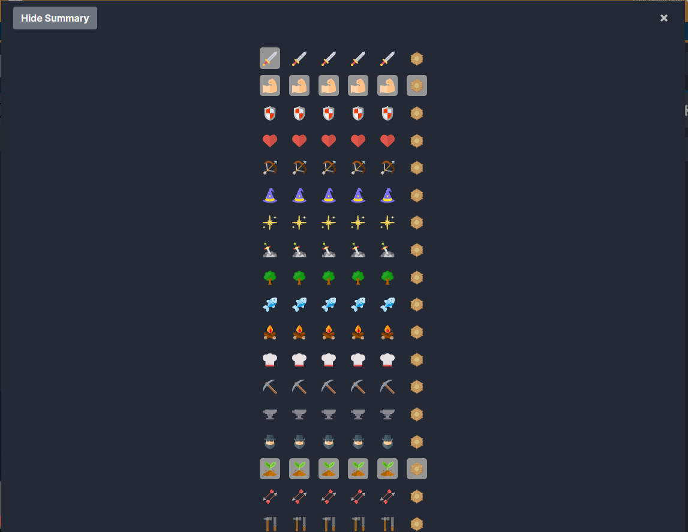
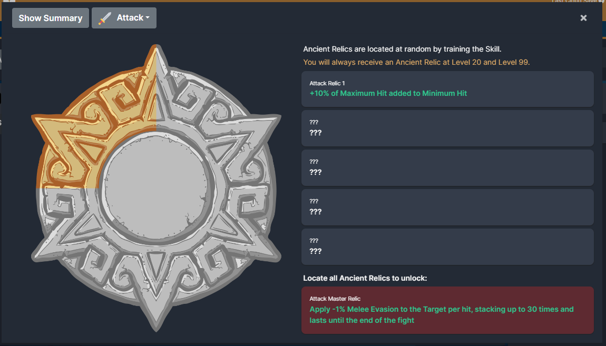
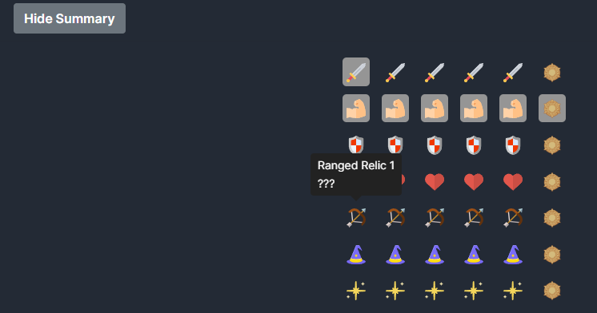
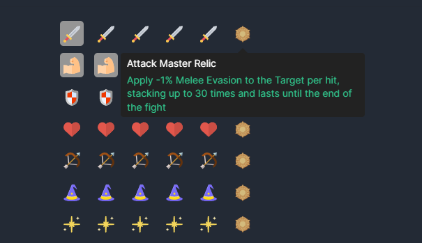

### 🚨 I am no longer maintaining this mod. 🚨
#### As of Feb 12th 2025, this mod still works on game version v1.3.1 ?12035. 

*This mod will be de-listed once a future game update breaks the mod from functioning. If you are interested in maintaining this mod, reach out on Discord.*

# [Myth] Incy Wincy Ancient Relics

This mod adds a summary view which has incy wincy ancient relics to easily see all your ancient relics from a glance, with unlocked ancient relics being highlighted.

A new button has been added on the ancient relics modal allowing you to switch between the summary or the individual skills view.

This button state is saved so when you reload if you are on the summary view it will remember this and load the summary view.

If you are not viewing the summary, it will load the existing view as is.

Tooltips show locked and unlocked ancient relics.

